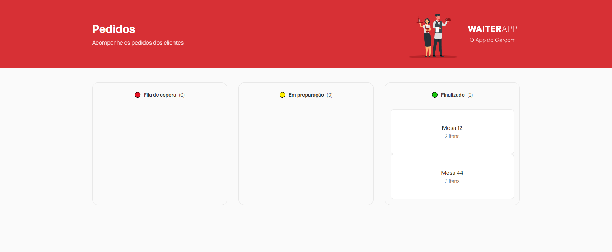
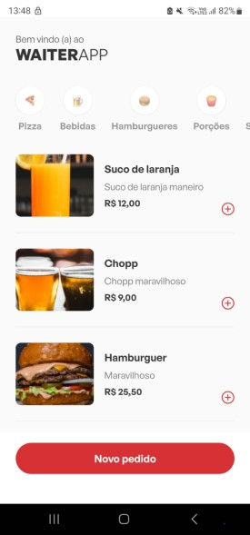

<h3 align=center>Working with:</h3>

  &nbsp
  &nbsp
  &nbsp
  &nbsp
  &nbsp
  &nbsp
  &nbsp

Projeto para controlar pedidos em um restaurante, sendo possível adicionar produtos a mesas e controlar em qual estágio o pedido está (fila de espera, em preparo ou feito)

<h3 align="center">WEB</h3>

  <h3>MOBILE</h3>
  

